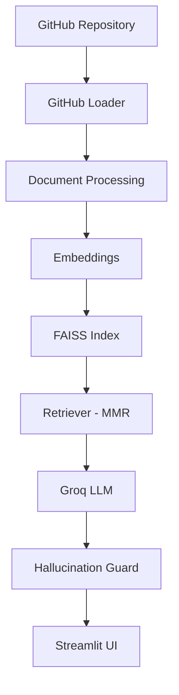

# PatchContext

PatchContext is a retrieval-augmented question answering system for the [FastAPI](https://github.com/fastapi/fastapi) repository. Instead of asking an LLM to answer questions about a codebase from memory, it retrieves the actual commits, pull requests, and issues that are relevant to the question, and generates an answer grounded in that context — with links back to GitHub.

**Live demo:** https://patchcontext-rag.streamlit.app/

## Why I built this

I kept running into the same problem when working on unfamiliar codebases: I could ask an LLM "why was this implemented this way?" and get a confident, plausible-sounding answer that had no connection to what actually happened in the repository. It's not that the model is wrong on purpose — it just doesn't have access to the PR discussion, the issue thread, or the commit message that explains the actual reasoning.

PatchContext tries to fix that by treating the repository's history (commits, PRs, issues) as the source of truth, retrieving the pieces relevant to a question, and only then asking the LLM to answer — with citations pointing back to the exact commit or PR.

FastAPI was a convenient repository to build this against: active history, a lot of substantive PR discussion, and issues that explain real design decisions.

## How it works

1. **Ingestion** — `scripts/ingest.py` pulls commits, issues, and pull requests from the GitHub API for `fastapi/fastapi` and writes them to `data/raw/`.
2. **Processing** — `document_processor.py` normalizes and chunks the raw records into documents suitable for embedding.
3. **Embedding** — chunks are embedded with a HuggingFace sentence-transformers model (`all-MiniLM-L6-v2`).
4. **Indexing** — embeddings are stored in a FAISS index under `vectorstore/faiss_index/`.
5. **Retrieval** — at query time, `retriever.py` uses MMR (Maximal Marginal Relevance) instead of plain top-k similarity, so the retrieved context isn't five near-duplicate chunks.
6. **Generation** — the retrieved context and question are passed to Groq (`llama-3.1-8b-instant` by default) to produce an answer.
7. **Hallucination guard** — before the answer is returned, `hallucination_guard.py` runs a local NLI cross-encoder (`cross-encoder/nli-deberta-v3-small`) to check whether the generated answer is actually entailed by the retrieved context.
8. **Citations** — `citations.py` attaches the source commit/PR/issue links so every answer is traceable back to GitHub.



## Features

- Repository-aware Q&A over commits, PRs, and issues
- MMR retrieval to reduce redundant context
- FAISS vector search
- HuggingFace sentence-transformer embeddings
- Groq-backed answer generation
- Local NLI-based hallucination check before returning an answer
- Clickable GitHub citations in every response
- RAGAs-based evaluation pipeline

## Project structure

```text
PatchContext/
│
├── app.py
├── README.md
├── requirements.txt
├── .gitignore
├── .env                  # local only, not committed
│
├── data/
│   ├── raw/
│   │   ├── commits.json
│   │   ├── issues.json
│   │   ├── pull_requests.json
│   │   ├── test_commits.json
│   │   ├── test_issues.json
│   │   └── test_prs.json
│   └── processed/
│
├── evaluation/
│   ├── benchmark_50.json
│   ├── report.md
│   └── results.json
│
├── scripts/
│   ├── ingest.py
│   ├── generate_benchmark.py
│   ├── evaluate.py
│   ├── test_guard.py
│   ├── test_helpers.py
│   ├── test_loader.py
│   ├── test_processor.py
│   ├── test_rag.py
│   └── test_retriever.py
│
├── src/
│   ├── config.py
│   ├── github_loader.py
│   ├── document_processor.py
│   ├── embeddings.py
│   ├── vector_store.py
│   ├── retriever.py
│   ├── rag_chain.py
│   ├── hallucination_guard.py
│   ├── citations.py
│   └── evaluation.py
│
└── vectorstore/
    └── faiss_index/
        ├── index.faiss
        └── index.pkl
```

## Installation

```bash
git clone https://github.com/<your-username>/PatchContext.git
cd PatchContext

python -m venv venv
source venv/bin/activate   # venv\Scripts\activate on Windows

pip install -r requirements.txt
```

### Environment variables

Create a `.env` file in the project root:

```
GITHUB_TOKEN=your_github_personal_access_token
GROQ_API_KEY=your_groq_api_key
```

The GitHub token is needed to avoid the low rate limits on unauthenticated API requests during ingestion. A token with read-only `public_repo` access is enough.

## Running the project

Build the index first:

```bash
python scripts/ingest.py
```

This fetches commits, issues, and PRs for `fastapi/fastapi`, processes them, and writes the FAISS index to `vectorstore/faiss_index/`. Depending on GitHub API rate limits, this can take a while on first run.

Then launch the app:

```bash
streamlit run app.py
```

## Example questions

- Why was dependency injection redesigned?
- Which PR introduced this feature?
- What discussion led to this implementation?
- Why was this commit made?
- Why was PR #16021 opened to optimize APIRoute handler caching?

## Evaluation

The system is evaluated with [RAGAs](https://github.com/explodinggpt/ragas) on a 50-question benchmark built from real FastAPI PRs and issues (`evaluation/benchmark_50.json`). A sample run is included in `evaluation/report.md`.

| Metric | Score |
| --- | --- |
| Faithfulness | 0.4481 |
| Answer Relevancy | 0.5802 |
| Context Precision | 1.0000 |
| Context Recall | 1.0000 |

Faithfulness is currently the weakest metric — the model sometimes paraphrases beyond what's directly stated in the retrieved context, even when the retrieval itself is on target. Context precision and recall are strong, which suggests the retrieval step is doing its job; the generation step is where most of the remaining error comes from.

Full metric definitions and per-question breakdowns are in `evaluation/report.md`.

## Limitations

- Scoped to a single repository (`fastapi/fastapi`); pointing it at another repo requires re-running ingestion and rebuilding the index.
- Retrieval quality depends on how well a commit/PR/issue was written in the first place — sparse commit messages give the retriever less to work with.
- The hallucination guard reduces unsupported claims but doesn't eliminate them; faithfulness scores above still show room to improve.
- Groq's free tier rate limits can slow down evaluation runs across the full 50-question benchmark.

## Future improvements

- Expand ingestion to support arbitrary repositories via a config flag
- Add re-ranking after MMR retrieval
- Cache embeddings across ingestion runs to avoid recomputation
- Run the full 50-question benchmark instead of a sampled subset
- Add streaming responses in the Streamlit UI
